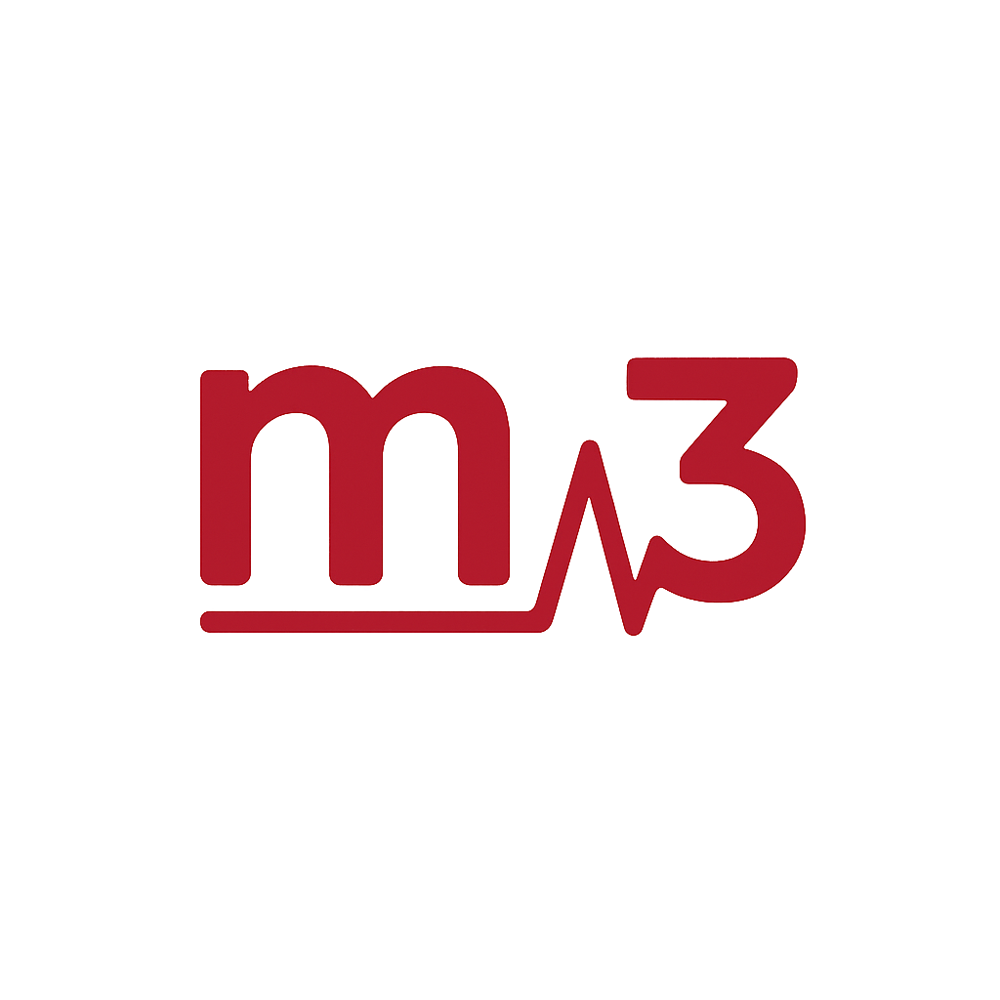

# M3: Medical Datasets ↔ MCP ↔ Models 🏥🤖

<div align="center">
  
</div>

> **Query tabular PhysioNet medical data using natural language through MCP clients**

<a href="https://www.python.org/downloads/"></a>
<a href="https://modelcontextprotocol.io/"></a>
<a href="https://github.com/rafiattrach/m3/actions/workflows/tests.yaml"></a>
<a href="https://github.com/rafiattrach/m3/actions/workflows/pre-commit.yaml"></a>
<a href="https://github.com/rafiattrach/m3/pulls"></a>

Transform medical data analysis with AI! Ask questions about MIMIC-IV and other PhysioNet datasets in plain English and get instant insights. Choose between local data (free) or full cloud dataset (BigQuery).

## 💡 How It Works

M3 acts as a bridge between your **AI Client** (like Claude Desktop, Cursor, or LibreChat) and your medical data.

1.  **You** ask a question in your chat interface: *"How many patients in the ICU have high blood pressure?"*
2.  **M3** securely translates this into a database query.
3.  **M3** runs the query on your local or cloud data.
4.  **The LLM** explains the results to you in plain English.

*No SQL knowledge required.*

## Features

- 🔍 **Natural Language Queries**: Ask questions about your medical data in plain English
- 🏠 **Modular Datasets**: Support for any tabular PhysioNet dataset (MIMIC-IV, etc.)
- 📂 **Local DuckDB + Parquet**: Fast local queries using Parquet files with DuckDB views
- ☁️ **BigQuery Support**: Access full MIMIC-IV dataset on Google Cloud
- 🔒 **Enterprise Security**: OAuth2 authentication with JWT tokens and rate limiting
- 🛡️ **SQL Injection Protection**: Read-only queries with comprehensive validation
- 🧩 **Extensible Architecture**: Easily add new custom datasets via configuration or CLI

## 🚀 Quick Start

> **New to this?** 📺 [Watch our 5-minute setup video](https://rafiattrach.github.io/m3/) to see it in action.

### Prerequisites
You need an **MCP-compatible Client** to use M3. Popular options include:
- [Claude for Desktop](https://claude.ai/download)
- [Cursor](https://cursor.com)
- [LibreChat](https://www.librechat.ai/)

### 1. Install `uv` (Required)

We use `uvx` to run the MCP server efficiently.

**macOS and Linux:**
```bash
curl -LsSf https://astral.sh/uv/install.sh | sh
```

**Windows (PowerShell):**
```powershell
powershell -ExecutionPolicy ByPass -c "irm https://astral.sh/uv/install.ps1 | iex"
```

### 2. Choose Your Data Source

Select **Option A** (Local) or **Option B** (Cloud).

#### Option A: Local Dataset (Free & Fast)
*Best for development, testing, and offline use.*

1.  **Create project directory:**
    ```bash
    mkdir m3 && cd m3
    ```

2.  **Initialize Dataset:**

    We will use MIMIC-IV as an example.

    **For Demo (Auto-download ~16MB):**
    ```bash
    uv init && uv add m3-mcp
    uv run m3 init mimic-iv-demo
    ```

    **For Full Data (Requires Manual Download):**
    *Download CSVs from [PhysioNet](https://physionet.org/content/mimiciv/3.1/) first and place them in `m3_data/raw_files`.*
    ```bash
    uv init && uv add m3-mcp
    uv run m3 init mimic-iv-full
    ```
    *This can take 5-15 minutes depending on your machine*

3.  **Configure Your Client:**

    **For Claude Desktop (Shortcut):**
    ```bash
    uv run m3 config claude --quick
    ```

    **For Other Clients (Cursor, LibreChat, etc.):**
    ```bash
    uv run m3 config --quick
    ```
    *This generates the configuration JSON you need to paste into your client's settings.*

#### Option B: BigQuery (Full Cloud Dataset)
*Best for researchers with Google Cloud access.*

1.  **Authenticate with Google:**
    ```bash
    gcloud auth application-default login
    ```

2.  **Configure Client:**
    ```bash
    uv run m3 config --backend bigquery --project_id BIGQUERY_PROJECT_ID
    ```
    *This also generates the configuration JSON you need to paste into your client's settings.*


### 3. Start Asking Questions!
Restart your MCP client and try:
- "What tools do you have for MIMIC-IV data?"
- "Show me patient demographics from the ICU"
- "What is the race distribution in admissions?"

---

## 🔄 Managing Datasets

Switch between available datasets instantly:

```bash
# Switch to full dataset
m3 use mimic-iv-full

# Switch back to demo
m3 use mimic-iv-demo

# Check status
m3 status
```

---

## Backend Comparison

| Feature | DuckDB (Demo) | DuckDB (Full) | BigQuery (Full) |
|---------|---------------|---------------|-----------------|
| **Cost** | Free | Free | BigQuery usage fees |
| **Setup** | Zero config | Manual Download | GCP credentials required |
| **Credentials** | Not required | PhysioNet | PhysioNet |
| **Data Size** | 100 patients | 365k patients | 365k patients |
| **Speed** | Fast (local) | Fast (local) | Network latency |
| **Use Case** | Learning | Research (local) | Research, production |

---

## ➕ Adding Custom Datasets

M3 is designed to be modular. You can add support for any tabular dataset on PhysioNet easily. Let's take eICU as an example:

### JSON Definition Method

1.  Create a definition file: `m3_data/datasets/eicu.json`
    ```json
    {
      "name": "eicu",
      "description": "eICU Collaborative Research Database",
      "file_listing_url": "https://physionet.org/files/eicu-crd/2.0/",
      "subdirectories_to_scan": [],
      "primary_verification_table": "eicu_crd_patient",
      "tags": ["clinical", "eicu"],
      "requires_authentication": true,
      "bigquery_project_id": "physionet-data",
      "bigquery_dataset_ids": ["eicu_crd"]
    }
    ```

2.  Initialize it:
    ```bash
    m3 init eicu --src /path/to/raw/csvs
    ```
    *M3 will convert CSVs to Parquet and create DuckDB views automatically.*

---

## Alternative Installation Methods

> Already have Docker or prefer pip?

### 🐳 Docker

<table>
<tr>
<td width="50%">

**DuckDB (Local):**
```bash
git clone https://github.com/rafiattrach/m3.git && cd m3
docker build -t m3:lite --target lite .
docker run -d --name m3-server m3:lite tail -f /dev/null
```

</td>
<td width="50%">

**BigQuery:**
```bash
git clone https://github.com/rafiattrach/m3.git && cd m3
docker build -t m3:bigquery --target bigquery .
docker run -d --name m3-server \
  -e M3_BACKEND=bigquery \
  -e M3_PROJECT_ID=your-project-id \
  -v $HOME/.config/gcloud:/root/.config/gcloud:ro \
  m3:bigquery tail -f /dev/null
```

</td>
</tr>
</table>

**MCP config (same for both):**
```json
{
  "mcpServers": {
    "m3": {
      "command": "docker",
      "args": ["exec", "-i", "m3-server", "python", "-m", "m3.mcp_server"]
    }
  }
}
```

### pip Install

```bash
pip install m3-mcp
m3 config --quick
```

### Local Development

For contributors:

1.  **Clone & Install (using `uv`):**
    ```bash
    git clone https://github.com/rafiattrach/m3.git
    cd m3
    uv venv
    uv sync
    ```

2.  **MCP Config:**
    ```json
    {
      "mcpServers": {
        "m3": {
          "command": "/absolute/path/to/m3/.venv/bin/python",
          "args": ["-m", "m3.mcp_server"],
          "cwd": "/absolute/path/to/m3",
          "env": { "M3_BACKEND": "duckdb" }
        }
      }
    }
    ```

---

## 🔧 Advanced Configuration

**Interactive Config Generator:**
```bash
m3 config
```

**OAuth2 Authentication:**
For secure production deployments:
```bash
m3 config claude --enable-oauth2 \
  --oauth2-issuer https://your-auth-provider.com \
  --oauth2-audience m3-api
```
> See [`docs/OAUTH2_AUTHENTICATION.md`](docs/OAUTH2_AUTHENTICATION.md) for details.

---

## 🛠️ Available MCP Tools

- **get_database_schema**: List all available tables
- **get_table_info**: Get column info and sample data
- **execute_mimic_query**: Execute SQL SELECT queries
- **get_icu_stays**: ICU stay info & length of stay
- **get_lab_results**: Laboratory test results
- **get_race_distribution**: Patient race statistics

## Example Prompts

**Demographics:**
- *What is the race distribution in MIMIC-IV admissions?*
- *Show me patient demographics for ICU stays*

**Clinical Data:**
- *Find lab results for patient X*
- *What lab tests are most commonly ordered?*

**Exploration:**
- *What tables are available in the database?*

---

## Troubleshooting

- **"Parquet not found"**: Rerun `m3 init <dataset_name>`.
- **MCP client not starting**: Check logs (Claude Desktop: Help → View Logs).
- **BigQuery Access Denied**: Run `gcloud auth application-default login` and verify project ID.

---

## Contributing & Citation

### For Developers
We welcome contributions!
1.  **Setup:** Follow the "Local Development" steps above.
2.  **Test:** Run `uv run pre-commit --all-files` to ensure everything is working and linted.
3.  **Submit:** Open a Pull Request with your changes.

**Citation:**
```bibtex
@article{attrach2025conversational,
  title={Conversational LLMs Simplify Secure Clinical Data Access, Understanding, and Analysis},
  author={Attrach, Rafi Al and Moreira, Pedro and Fani, Rajna and Umeton, Renato and Celi, Leo Anthony},
  journal={arXiv preprint arXiv:2507.01053},
  year={2025}
}
```

You can also use the "Cite this repository" button at the top of the GitHub page for other formats.

## Related Projects

M3 has been forked and adapted by the community:
- [MCPStack-MIMIC](https://github.com/MCP-Pipeline/mcpstack-mimic) - Integrates M3 with other MCP servers (Jupyter, sklearn, etc.)

---

*Built with ❤️ for the medical AI community*

**Need help?** Open an issue on GitHub or check our troubleshooting guide above.
